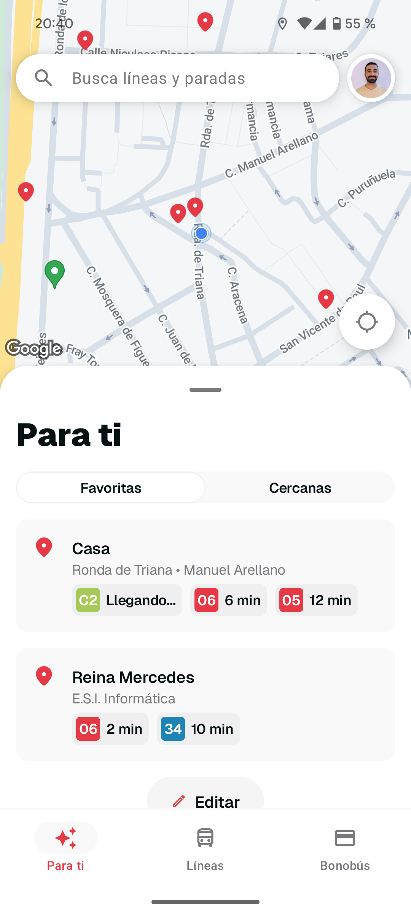
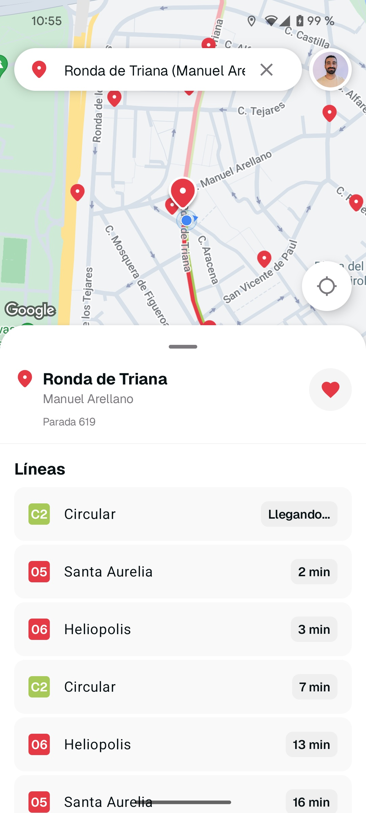
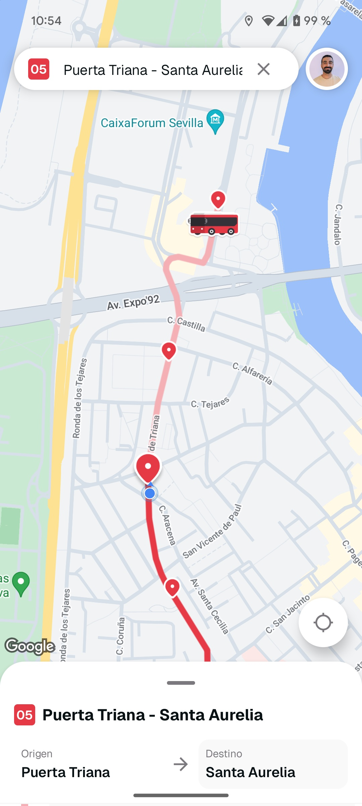
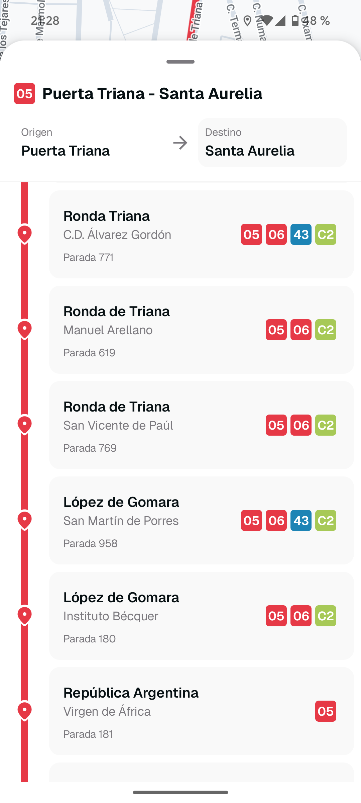
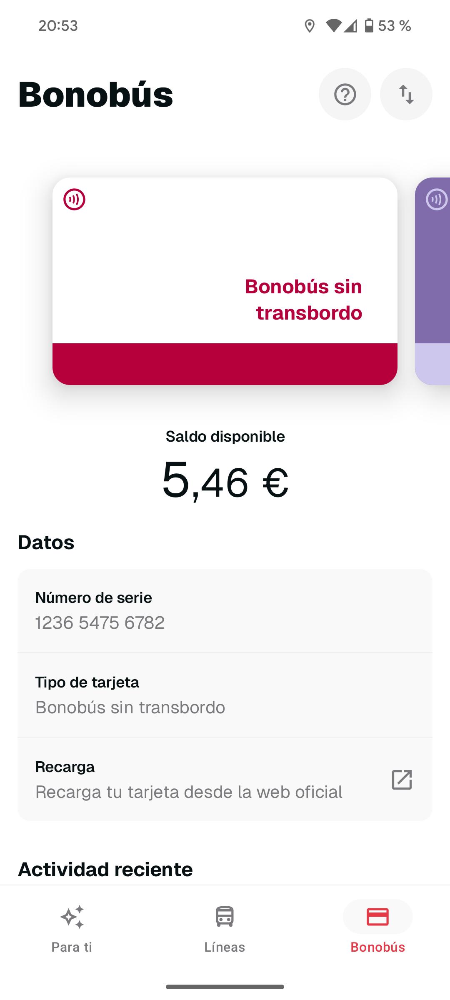
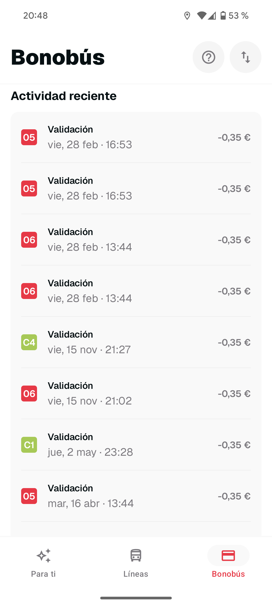

# SeviBus - Android

SeviBus is a non-profit, independent, unofficial application for public transportation in Seville, Spain. The app allows users to check bus arrival times, view routes on a map, manage favorite stops, and even check Bonobús card balances using NFC.

Available since 2010, SeviBus was the first public transportation application for Sevilla. It has been continuously updated and maintained over the years, embracing modern design principles and development practices with each iteration to provide the best possible experience for users.

## Screenshots

| | | |
|:---:|:---:|:---:|
|  |  |  |
|  |  |  |

## Download

## Features

- ⏱️ **Instant arrival times** – Never miss a bus again. Check real-time arrivals to any stop
- 🚌 **Real-time location** – Track buses on the map!
- 🗺️ **Visualize bus lines on the map** – Find your route easily
- ⭐ **Favorites with one touch** – Save your preferred stops and access them with a single tap
- 🪪 **Bonobús cards** – Check your travel card balance and recharge it online

## Project Structure

The project follows Modern Android Development practices and is built with:

- Kotlin
- Jetpack Compose for UI
- MVVM architecture
- Koin for dependency injection
- Kotlin Coroutines and Flow
- Google Maps integration
- Firebase services (Analytics, Crashlytics)
- Google Authentication
- Room for local database
- NFC capabilities for reading transport cards

### Disclaimer
This is a real personal project intended for production, not an interview exercise. Given the development conditions and time constraints, shortcuts have been taken. Even if the project follows modern development techniques and good practices, don't be surprised to find parts that need improvement or could be done in a better way.

### Main packages

- `ui`: Compose UI components and themes
- `feature`: Feature-specific code (stops, lines, cards, map, etc.)
- `domain`: Domain models and business logic
- `data`: Data repositories and sources
- `infrastructure`: App infrastructure, DI, logging, etc.
- `navigation`: Navigation components

## Development

### Requirements

- JDK 17
- Google Maps API key (for local development)

### Building

1. Clone the repository
2. Create a `secret.properties` file in the project root with necessary API keys
3. Build the project

## Authors

- Developed by [Rafa Vázquez](https://x.com/sloydev) in Sevilla
- Designed by [Alex Bailon](https://donbailon.com/2025) from Costa Brava

## License

This project is licensed under the [Mozilla Public License 2.0](LICENSE) - see the [LICENSE](LICENSE) file for details. 

The MPL 2.0 is a "weak copyleft" license that allows you to use the code in various ways while ensuring that specific modifications to the original files remain open source. It's designed to be compatible with both proprietary software development and open source, which means:

- You can use, modify, and incorporate parts of this code into your projects (even proprietary ones)
- If you modify the original source code files, you must make those specific modifications available under the MPL 2.0
- The license is file-based, meaning only the modified original files must remain under the MPL 2.0
- You must provide attribution to the original authors 